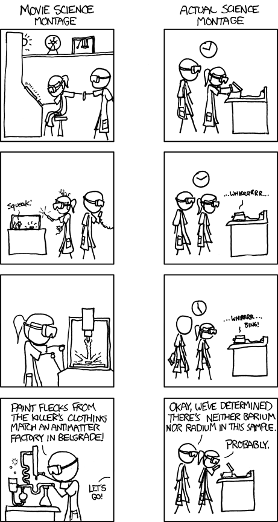

<small>(Image from [xkcd.com](http://xkcd.com))</small>

I wrote last month about making science into a open-source software project, which discusses the pros and cons of using forking and "bug-tracking" for academic papers. Much of what I was trying to describe is a GitHub for science, a concept that [@marciovm](http://twitter.com/marciovm) has blogged about recently.

In his [I Want a GitHub of Science](http://marciovm.com/i-want-a-github-of-science) post he takes a different angle on the idea, in which the git model is used to explore how science could break out of the "old-media" style publishing. He says that scientists are being judged (when applying for jobs) based on their publishing record, the more prestigious journals, the better. However these journals cannot publish every good paper that they come across, which "exposes the system to vulnerabilities common to any decision by committee -- especially semi-secret committee -- such as lack of agility, an aversion to disruptive innovation, and the tendency of committee members (and their friends) to be more equal in their own eyes than anyone else". These editorial decisions are having an effect on people's careers, and on science as a whole.

He goes on to propose an alternative publishing structure, similar to GitHub, where everyone can publish their papers, and alternative metrics are used to sort the wheat from the chaff. He also explains that it would encourage authors to publish more of their data, helping the Open Science efforts.

I like the "long-tail" aspect of this model - by publishing more science, more can be studied and examined. However I think that the article misses some crucial aspects of GitHub. As Marcio points out, the git control system was developed by the Linux community, to help co-ordinate work on the Linux code repository. This collaboration is key to the success of GitHub - anyone can fork the code and contribute to the community. This is where my post about forking science papers comes in - anyone can contribute and collaborate on a science project with GitHub-like software (let's call it ScienceHub). This would also be reflected on their ScienceHub profile and impact graph, the focus of Marcio's post. For me, collaboration is key, and ultimately that's what GitHub is good at.

I do have slight concerns over the single-point-of-failure that something like ScienceHub would become - although these fears are allayed if an open-source solution is found.
