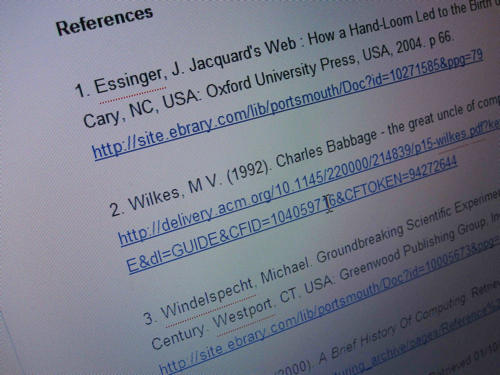

So it's late at night and I'm still annoyed from earlier about referencing - you may have seen my [tweets](http://www.twitter.com/40_thieves), which were less than courteous about [EndNote](http://www.endnote.com) and [Zotero](http://www.zotero.org), two different bits of referencing software that I've used. They basically try and grab meta data from websites, PDFs and other places to build library of references which they then can format it to turn it into properly formatted references. Here's the problem though they're universally _crap_ doing the getting the meta data part - don't get wrong the bells and whistles of organising and sorting the references once you've got them are great. But I am completely fed up of manually entering data to fill in gaps where they've missed something or completely got it wrong. This is the real problem that needs solving - organisation of references is pretty easy if you set up a simple file structure, something that even a non-techie can do - its much harder to build something that can accurately guess the references.

So I'm hoping that somewhere out there someone will know of my frustration and send me towards something that'll work better. I've already had a [couple](http://twitter.com/mrgunn/status/28793402554) of [people](http://twitter.com/AceBlaster/status/28801963300) on Twitter send me links to similar things, but they look suspiciously like EndNote clones but with more organisational features. I'll try them out and see how they work but I'm not sure if they solve the problem of manually adding meta data.

Personally I hope that the new semantic web technologies in HTML5 will go a long way towards this --- being able to tag author, date, publisher meta data like this is going to make detection a lot better. But, it probably won't be adopted on many academic sites, and it doesn't work in PDFs that academics so dearly love. The open data movement really needs to get the word out to these websites.
